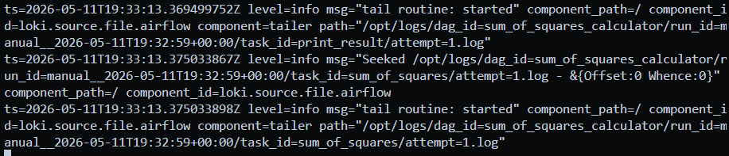
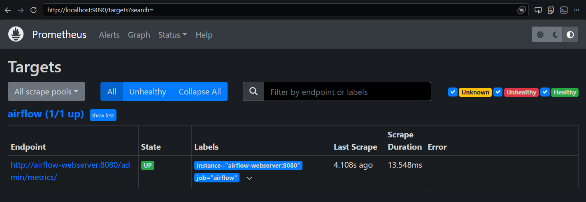
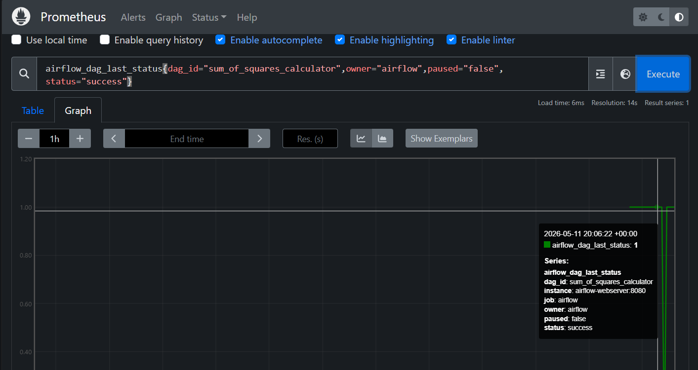
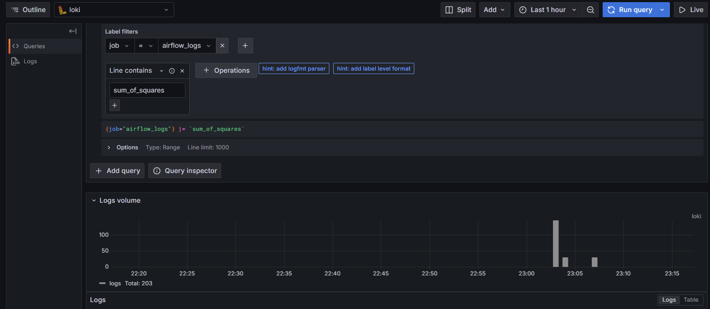
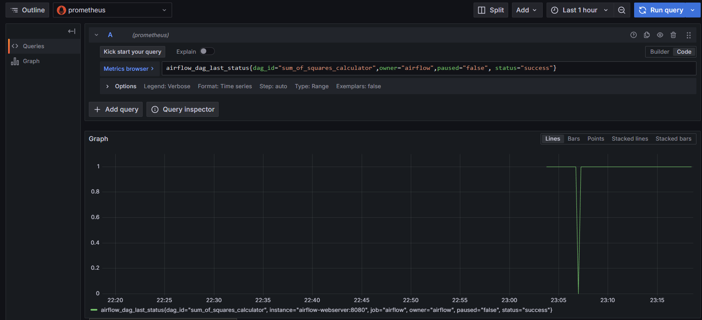
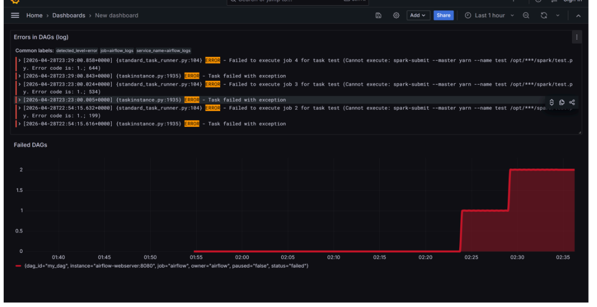
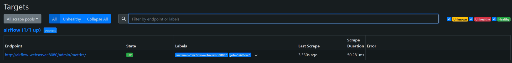
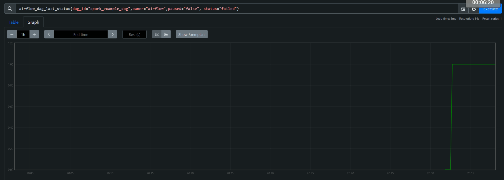
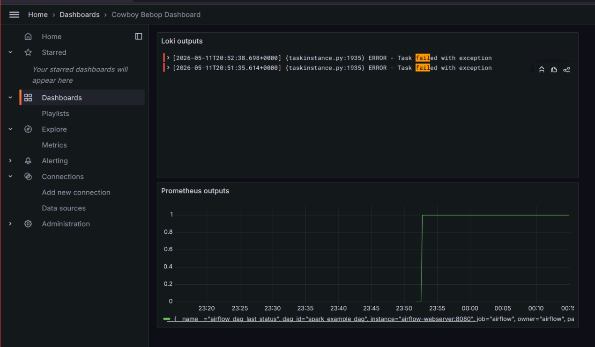

# cowboy_bebop_devops_hws
Домашние задания по курсу "DevOps практики и инструменты", весна 2026

# ЛР 2. Airflow + Spark

## Содержимое
* `Dockerfile` - образ на основе `apache/airflow:2.7.1` с установленными `procps`, `default-jre` и провайдером `apache-airflow-providers-apache-spark`; копирует DAG’и и Spark‑скрипты.
* `docker-compose.yml` - оркестрация сервисов: `postgres`, `spark-master`, `spark-worker`, `airflow-init`, `airflow-scheduler`, `airflow-webserver`.
* `dags/spark_dag.py` - DAG `spark_example_dag`, запускающий Spark‑приложение через `SparkSubmitOperator`.
* `spark/test_script.py` - Spark‑задание, которое создает `SparkSession`, строит тестовый DataFrame и выводит его содержимое.

## Работа нового DAG’а
DAG `spark_example_dag` содержит единственную задачу:
* `run_spark_job` - отправляет `spark/test_script.py` в кластер Spark через `spark-submit`.

PySpark:
* Подключается к мастеру `spark://spark-master:7077`.
* Создает небольшой DataFrame с людьми и возрастом.
* Отображает его в логах (`df.show()`).
* Выводит общее количество записей.

Запуск DAG’а производится вручную через веб‑интерфейс Airflow. Дополнительные параметры не требуются.

## Локальный деплой

### Предварительные требования
* Установлены Docker и Docker Compose (или Docker Desktop с `docker compose` plugin).

### Шаги
1. Склонировать репозиторий
2. Запустить контейнеры

```bash
docker compose up --build -d
```

3. Дождаться сборки без ошибок (health для всех), если контейнер с postgres не собирается, то:
```bash
sudo systemctl stop postgresql
```
И запустить compose up повторно

4. Открыть браузер по адресу `http://localhost:8080` и ввести логин и пароль, которые заданы в compose:
   * Логин: `admin`
   * Пароль: `admin123`
5. Создать подключение к Spark в Airflow: Admin → Connections → "+":
   * Connection Id: `spark_default`
   * Connection Type: `Spark`
   * Host: `spark://spark-master`
   * Port: `7077`
   * Extra: `{}` (без этого не подключалось)
6. На странице DAGs найти и запустить `spark_example_dag`, подождать завершения
7. Посмотреть на Spark Web UI `http://localhost:4040` состояние приложения в `Completed Applications`

### Выполнение практической работы



#### Для sum_of_squares_calculator











#### Для spark_example_dag








### Остановка
```bash
docker compose down -v  # удалит тома БД (чистый сброс)
```

## Примечания
* DAG работает только по ручному триггеру, расписание отсутствует (`schedule_interval=None`).
* Spark‑кластер (`spark-master` и `spark-worker`) стартует вместе с остальными сервисами и доступен по портам `4040` (веб‑интерфейс) и `7077` (подключения).
* Все скрипты, лежащие в локальной папке `spark/`, монтируются в контейнер Airflow по пути `/opt/airflow/spark`.
* Логи Airflow сохраняются в локальной директории `./logs`.
