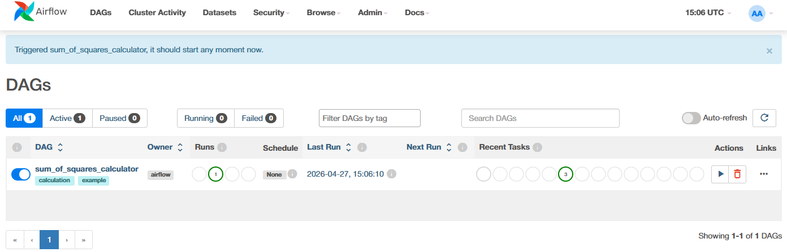

# cowboy_bebop_devops_hws
Домашние задания по курсу "DevOps практики и инструменты", весна 2026

# ЛР 1. Airflow + docker compose

## Содержимое
* `Dockerfile` - образ на основе `apache/airflow:2.7.1`, копирует DAG'и.
* `docker-compose.yml` - оркестрация сервисов: `postgres`, `airflow-init`, `airflow-scheduler`, `airflow-webserver`.
* `dags/my_calculator_dag.py` - DAG для вычисления суммы квадратов чисел от 1 до N.

## Работа DAG'а
DAG `sum_of_squares_calculator` содержит три задачи:
1. `generate_numbers` - генерирует список чисел от 1 до N (N задается параметром, по умолчанию 10).
2. `sum_of_squares` - вычисляет сумму квадратов этих чисел.
3. `print_result` - выводит результат в логи.

Запуск осуществляется вручную через UI Airflow. Можно передать параметр `{"N": значение}` при запуске.

## Локальный деплой

### Предварительные требования
* Установлены Docker и Docker Compose (или Docker Desktop с `docker compose` plugin).

### Шаги
1. Склонировать репозиторий
2. Запустить контейнеры с помошью команды

```bash
docker compose up --build -d
```
3. Дождаться сборки юез ошибок, если контейнер с postgres не собирается, то:
```bash
sudo systemctl stop postgresql
```
И запустить compose up снова

4. Открыть браузер по адресу `http://localhost:8080` и ввести логин и пароль, которые заданы в compose:
   * Логин: `admin`
   * Пароль: `admin123`
5. Найти DAG `sum_of_squares_calculator`, включить его (переключатель Off → On) и запустить вручную, при желании можно поменять параметр `N`
6. Результат выполнения можно посмотреть в логах задачи `print_result`




### Остановка
```bash
docker compose down -v  # удалит тома БД (чистый сброс)
```

## Примечания
* DAG не запускается по расписанию - только вручную.
* При первом запуске Airflow инициализирует базу данных и создает пользователя.
* Логи сохраняются в локальной директории `./logs`.